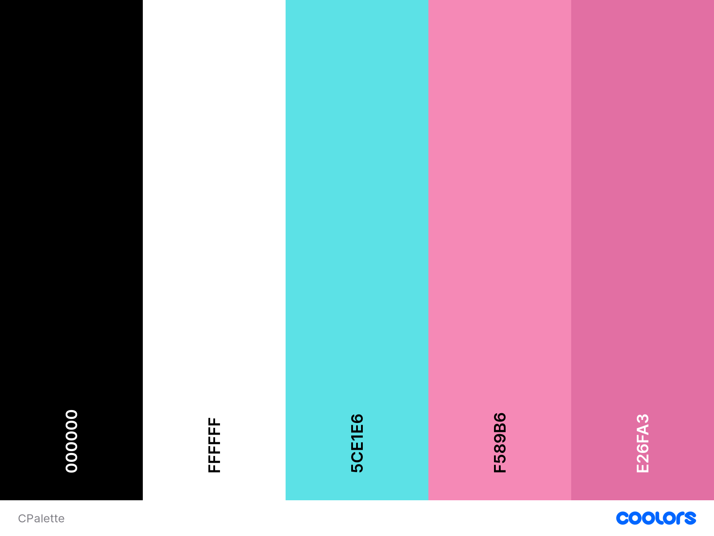
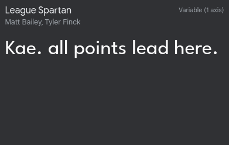
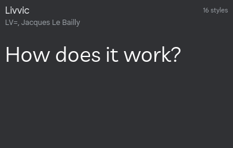
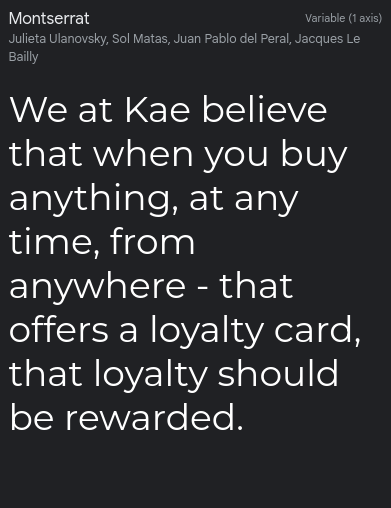
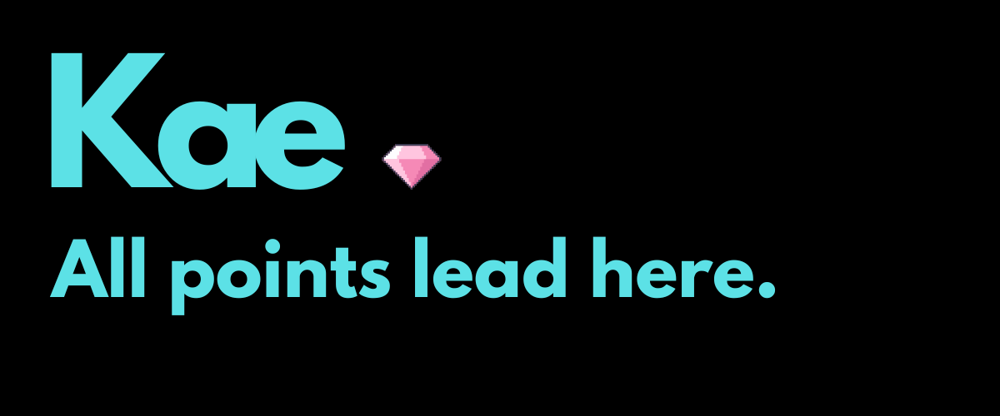

# Kae Loyalty Card Website

Created by Jordean Ulysses

To view the Live project: */ Insert live link later*/

*/ Insert screen view of main pages on various devices*/

This is the main website for the Kae collective loyalty card.

### Kae Collective Loyalty Card

This is the readme file and documentation to go alongside my milestone project. My particular project is to build an informational website about the fictional Kae collective loyalty card wit hte goal to update it an d improve it as my skills grow. The project is being built using HTML5, CSS and bootstrap as my first milestone project. This is part of Code Institute's Introduction to Web Development Diploma.

## Contents

1. Project Planning & User Experience.

   * Purpose of Project User Experience (UX)
   * Client Goals
   * About my Client
   * User Goals (First Visit, Returning and Frequent users)
   * The Five Planes

2. Design layout & Structure.

   * Wireframe
   * Structure
   * Colour Palette
   * Typography
   * Imagery
  
3. Technologies Used.

   * Languages
   * Frameworks, Libraries and Programs used
 Bootstrap: v4.2.1

   * Future Ideas (Actual login submission options, animations, tie ins with other sites, Youtube page, live chat)

4. Testing.

   * Wc3
   * Peer Review
   * Bugs
   * Accessibility

5. Deployment.
   *

6. Credits.

## Project Planning & User Experience (UX)

With the principles of design I have followed the five planes of stratergy, Scope, Structure & Surface. My aim is to make my website as responsive, clear, accessible and eye catching in order to be appealing to both business and regular patrons.

### Purpose of the Website

The purpose of the website is to display to international users and partners the benefits of the card not only as a user but to companies themselves in terms of attracting more custom.

### About Kae

The idea for the card came from I myself noticing that although a lot of restaurants and supermarkets have and market loyalty cards for use in store and on their own websites; there are a vast number of customers who will now prefer to order groceries online through third parties for the sake of convenience and speed especially since the pandemic. There is a gap in the market for those customers who lose out on the typical rewards they'd receive for their patronage if they had shopped in person.

### User Goals

The website will be for different users with different agendas.

* To view who Kae are
* To answer and develop FAQs
* To be able to see and suggest partners the company currently work with
* To sign up for the card with multiple options for personalised design
* To be able to contact the company in case of any issues by  email, phone or post

### Company Objectives

* To build a ciustomer and business based clientele
* To have a legitimate and official looking website
* To develop a online presence and spread the word within professional and customer based networks. 
* To be accessible and personable.
  
### First Time Visitor

* A first time visitor will want to understand the purpose of the card and the benefits it will have for them.
* They will want to know what companies also work alongside Kae and if it will align with what they want from the card. 
* They may use it to find other companies loyalty schemes.
* #The may use it to contact the company with suggestions or further questions not answered in the FAQ section.
* The may use it to find out if the company is LGBT inclusive and aligns with their morals.

### Returning Visitors

* A returning visitor might want to view the updated partners or features of the card.
* They may have lost a card or forgotten their details and be looking to have this rectified.
* They could be looking to download the app directly if it can't be found using application stores.
* They might find that they want a physical version of the card for aesthetic and convenience purposes. 

### Frequent Visitors

* Will likely be there to check if Kae may apply to a service they've recently signed up to.
* They will use the site to view their collective loyalty points across multiple platforms instead of individually.
* They also may want to check if Kae applies to services they may be using internationally.

## The Five Planes

#### Strategy

Questions I have considered during my research include:
* Who is likely to use this site? 

*Who are my target Audience? 

My target audience is people who may be looking to save money by being rewarded for their patronage no matter the shopping format. My target also includes business who may have seen or notice Kae's partnership with other larger brands and want to research how/if it would be beneficial for them to also develop a partnership. 

*Is the content relevant? 

In order to achieve this, I'll need to make sure that the site looks professional, is accessible and easy to navigate for all users and contains relevant information that users may be looking to find on a first or returning visit. 

* Company Goals 

I would love Kae to become an official option for international stores to have their customers use. Alot of people rely on loyalty points whether it be when they are low on money,just would like a freebie or are doing large shops for events (such as Christmas or parties) and frequently will save points over periods of time to use for these specific purposes.Given the current economic climate across the world, if Kae were established in the regions mentioned on the site, it could be a large help to all kinds of people.

#### Scope

Needs: The website needs to have a clear purpose from the landing page. 

Must Have Pages: Home, Partner Page, FAQ section or page, Sign Up & Contact page

Potential options for later: App download, Login page, Animated interface, 404 page.

#### Structure

The website needs to be clear and simple structure, with easy to follow straightforward links. It needs to be consistant and meet conventions of structure to allow ease of use and user consistency.

#### Skeleton

Navigation: Very simple Navigation bar

Interface: Needs to be visually appealing and clear. Meets the needs of users!

Features: The features I use must be useful, and follow the same pattern. Infomation needs to be put in priority order. With minimal features and complexity to add to usebility and a better user experience.

#### Surface

I wanted the design to be minimalistic with a futuristic feel to it so it would be simple enough for all users to read and process while at the same time still presenting modernity.

I feel that by having such a design, it would be more intriguing to younger clients and in turn intrigue business who might want to extend to a larger demographic than they already have. 

## Design Layout & Structure

### Wireframes

 (Wireframe will be added here)

### Structure

The structure of my site is 

* Home
* Our Partners
* Get Kae. (Sign Up)
* Contact Us

### Colour Palette

Colour Palette generated using Coolors (https://coolors.co/)

### Typography

 

### Imagery

Hero Image: Designed by myself using Canva

The large majority of the imagery used was designed by myself using features from Canva, and any card imagery was generated using Placeit. Any company logos were found as png/svg formats on https://companieslogo.com/,https://freebiesupply.com/, pngwing.com and Google images.

## Technologies used

### Languages

* HTML 5
* CSS

### Frameworks, Libraries and Programmes

* Bootstrap - In accordance with the tutorial I was used to this project was created using Bootstrap v4.2.1
* Fontawesome.com: Provided any icons used across the site.

### Future Ideas

## Testing

### WC3

### Peer Review

### Bugs

Is my site accessible (siteimprove.com):

### Accessibility

## Deployment

## Credits

I would like to thank my mentor Gareth for being incredibly helpful despite everything being quite last minute.

I would likely to sincerely thank the members of the Code Institute's Student Support. Without their encouragement and assistance I wouldn't have been able to complete this at all. 